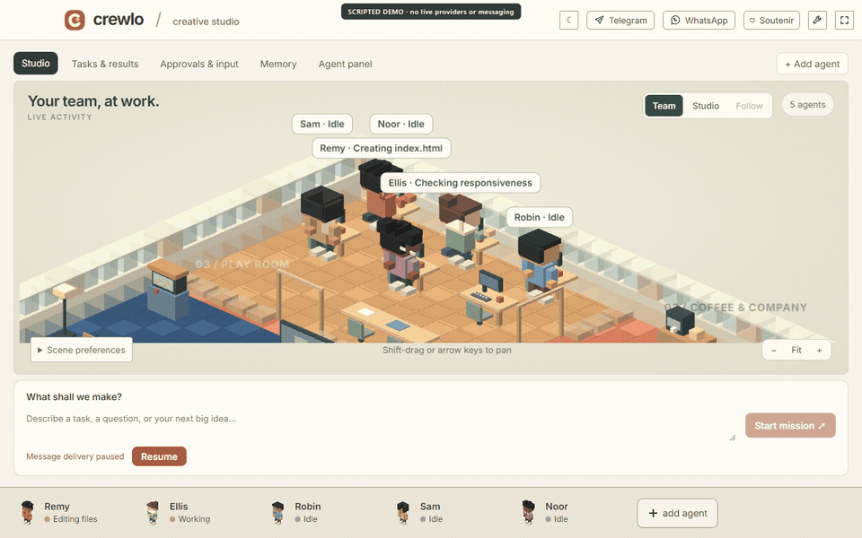
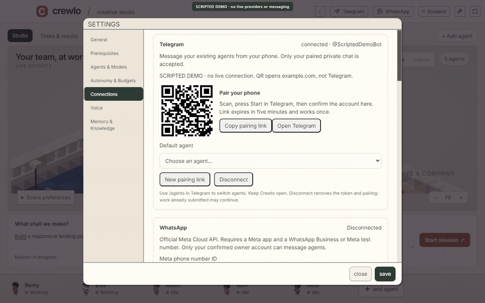

# Crewlo

**Your agents. One living workspace.**

A local desktop studio for your AI crew. Give agents a mission, see what they are doing, and open their conversations or terminals from a warm voxel workspace.

[Build from source](#build-from-source) · [Watch the 18-second demo](docs/crewlo/demo/crewlo-demo.mp4) · [Preview the website](#preview-the-website-locally) · [Connect your phone](#from-your-phone) · [Contribute](CONTRIBUTING.md) · [☆ Star Crewlo](https://github.com/HafidIdrissi/crewlo)

[](docs/crewlo/demo/crewlo-demo.mp4)

*Real interface recording with a scripted roster and simulated events—not live AI execution. Prefer a still? [Open the studio image](docs/crewlo/demo/studio-poster.png). [Video, captions and demo details](docs/crewlo/demo/README.md).*

## Why Crewlo?

- **See the work, not just the terminals.** Activity labels above agents reflect execution-hook events when available. Select a character to inspect its conversation or terminal.
- **Give the crew one clear mission.** A wide composer keeps your request in focus, with one delivery status and an explicit Resume control when message delivery is paused.
- **Keep the useful tools close.** Tasks & results, Approvals & input, Memory and Settings remain part of the same workspace.
- **Check in from your phone.** Optional Telegram and WhatsApp connections route owner messages to existing connected agents, with public replies and channel badges in Conversation.

Bring the agent CLI you already use: provider presets include Claude Code, Codex, Gemini CLI and others. Your accounts and credentials stay under your control; coordination and remote-messaging support vary by provider.

## Current status

Crewlo is an early, source-first project. Local Windows checks cover the interface, real local terminal access, messaging queues, SQLite and OS-encrypted credential storage. Typechecks, production builds and focused feature tests have passed; the full test suite still has [documented baseline failures](docs/crewlo/VERIFICATION.md).

Telegram/Meta traffic and agent replies in the messaging tests are simulated. Your credentials, public WhatsApp callback and actual model replies still need a [live acceptance test](docs/messageries-tests.fr.md). Packaged installers, signing and macOS/Linux runtime behavior have not been verified. There is no Crewlo release feed.

## Build from source

You need Git, **Node.js 22.22 or newer**, npm, and the credentials required by your chosen agent CLI. Provider setup is available through onboarding; provider subscriptions and API usage are separate from Crewlo.

On **Windows**, the native `node-pty` dependency also requires Visual Studio C++ build tools, the Windows SDK and matching MSVC Spectre-mitigated libraries. If installation reports `MSB8040`, add those libraries in Visual Studio Installer, then rerun `npm ci`.

Run `npm run doctor` from the checkout to check prerequisites before installing, and again after installation to check the native runtime. It does not install software or change your settings. [Windows quick start and troubleshooting — français](docs/crewlo/QUICKSTART.fr.md).

Clone the repository, or skip the first two commands if you already have a checkout:

```sh
git clone https://github.com/HafidIdrissi/crewlo.git
cd crewlo
npm ci
npm run dev
```

Complete onboarding, connect an agent and open a studio. Review the chosen CLI's permissions and automation settings before giving it work; execution permissions depend on those settings.

To check the code and preview a production build:

```sh
npm run typecheck
npm run test:focused
npm run build
npm run preview
```

The test runner expands filenames portably, including on Windows. See [verification and known baseline failures](docs/crewlo/VERIFICATION.md) and [messaging checks](docs/messageries-tests.fr.md) to distinguish focused test results from the full suite.

## In the studio

1. Start a mission from the composer. Crewlo routes it through the coordinator and message-delivery controls.
2. Click a figurine or use the keyboard-accessible roster to open an agent's conversation or terminal.
3. Open Tasks & results to inspect actual task records, or Approvals & input when work needs your attention.
4. If the composer says **Message delivery paused**, use **Resume** on the desktop when you are ready.

<details>
<summary>Scene controls, accessibility and visual states</summary>

- Collapse the agent panel to focus on the studio, or drag its divider to resize it. With the scene focused, arrow keys pan, +/− zoom, and 0 or Fit resets the camera.
- Additional agents expand the individual desks. The roster scrolls as the crew grows.
- In smaller windows, the conversation panel sits below the studio. Selecting an agent scrolls to it; **Back to studio** returns to the scene. Reduced motion disables figurine animation.
- Agents come from the actual roster. Confirmed idle agents may take clearly labeled cosmetic breaks, rendered locally without prompts or tokens. Unknown, queued, blocked and disconnected agents never take leisure breaks. Smoking is opt-in per agent in Scene preferences.
- The workshop, break room, game room and terrace are visual zones, not separate autonomous teams.

[Voxel implementation and verification](docs/crewlo/VOXEL.md) · [1920 desktop](docs/crewlo/voxel-workplace-1920.png) · [1440 desktop](docs/crewlo/voxel-workplace-1440.png) · [Empty studio](docs/crewlo/voxel-empty.png) · [Animation recording](docs/crewlo/voxel-animation.webm)

Populated screenshots are labeled test fixtures, not evidence of running agents or completed work.

</details>

## From your phone

Both channels use single-use pairing links/QRs and desktop confirmation. Only the paired owner's private messages are accepted. They use existing connected agent sessions; they do not start agents, approve tools or remotely resume paused delivery. Keep Crewlo open and your PC awake.

| | Telegram | WhatsApp |
| --- | --- | --- |
| Official transport | Bot API long polling | Meta Cloud API and signed webhooks |
| What you supply | A BotFather bot token | Meta app, Cloud API number, access token, App secret and verification token |
| Public endpoint | None required | Your own HTTPS callback forwarded to Crewlo's local receiver |
| Important limit | Another poller/webhook must not use the same bot | Free-form replies need an open 24-hour user-message window; no automatic tunnel setup |

Open **Telegram** or **WhatsApp** from Crewlo's top bar, complete setup and confirm your identity on the desktop. Send `/agents` to list agents, then `/agent <id>` to select one. Send plain text and check the agent-named reply in your phone chat and Crewlo's Conversation view.

[Telegram setup](docs/telegram-setup.md) · [Telegram + WhatsApp setup and live-test checklist — français](docs/messageries-tests.fr.md)

WhatsApp's **Accepted** state is not proof of delivery: **Delivered** and **Read** come from Meta receipts. Paused, unavailable, failed or uncertain delivery remains visible. Consult Conversation before resending an uncertain message.

<details>
<summary>Watch the Telegram setup interface demo</summary>



*Scripted setup demo only. The QR opens example.com and cannot pair a bot. No real Telegram delivery is shown. [Static setup image](docs/crewlo/demo/telegram-poster.png).*

</details>

## Local workspace, explicit connections

Crewlo stores workspace state locally. Telegram and WhatsApp credentials use an OS-encrypted vault, with no plaintext fallback; conversation history is not encrypted by those features. Connected cloud providers and messaging services receive the data needed for their work—local-first does not mean offline-only.

Anonymous usage analytics requires a configured build-time key and can be disabled in Settings or with `DO_NOT_TRACK`. See the [telemetry contract](TELEMETRY.md) for its allowlisted events.

## Help shape Crewlo

Try the source, [report a reproducible bug](https://github.com/HafidIdrissi/crewlo/issues), or take on one small improvement. Windows/macOS/Linux verification, accessibility, messaging and clearer agent activity are useful places to contribute. Read the [contribution guide](CONTRIBUTING.md) before opening a PR.

If Crewlo interests you, [give the repository a star](https://github.com/HafidIdrissi/crewlo). Starring happens on GitHub after you sign in; Crewlo never requests a GitHub token or stars automatically.

**Buy me a coffee:** the support entry is ready on the site and in the app, but disabled until the maintainer supplies their own payment link. No donation is routed to an unconfirmed account. The destination is configured in [docs/crewlo-links.json](docs/crewlo-links.json).

### Preview the website locally

After installing dependencies, run:

```sh
npm run site
```

Open the localhost address shown in your terminal. This serves the website locally; it does not publish anything.

[Shareable demo kit](docs/crewlo/demo/README.md) · [Design system](DESIGN.md) · [Asset origins](docs/crewlo/ASSETS.md) · [Engine architecture](docs/ARCHITECTURE.md)

## Credits

Crewlo is independently maintained and builds on [Munder Difflin](https://github.com/chaitanyagiri/munder-difflin), by Chaitanya Giri and contributors. The original copyright notices and [MIT license](LICENSE) are preserved. [Engineering notes](docs/crewlo/ENGINEERING_NOTES.md) cover the project's foundations and compatibility choices.

Original Crewlo artwork is MIT-licensed. Bundled third-party art and fonts retain their own licenses, including credits to [LimeZu](https://limezu.itch.io/) and [shahar061/the-office](https://github.com/shahar061/the-office). See [asset licenses](LICENSE-ASSETS) and [full attribution](src/renderer/src/assets/ATTRIBUTION.md).
