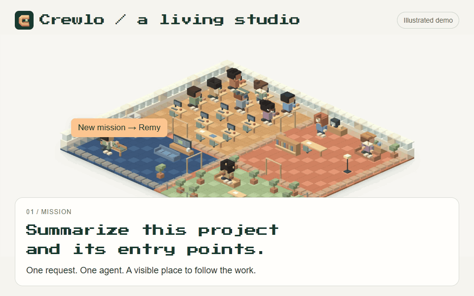
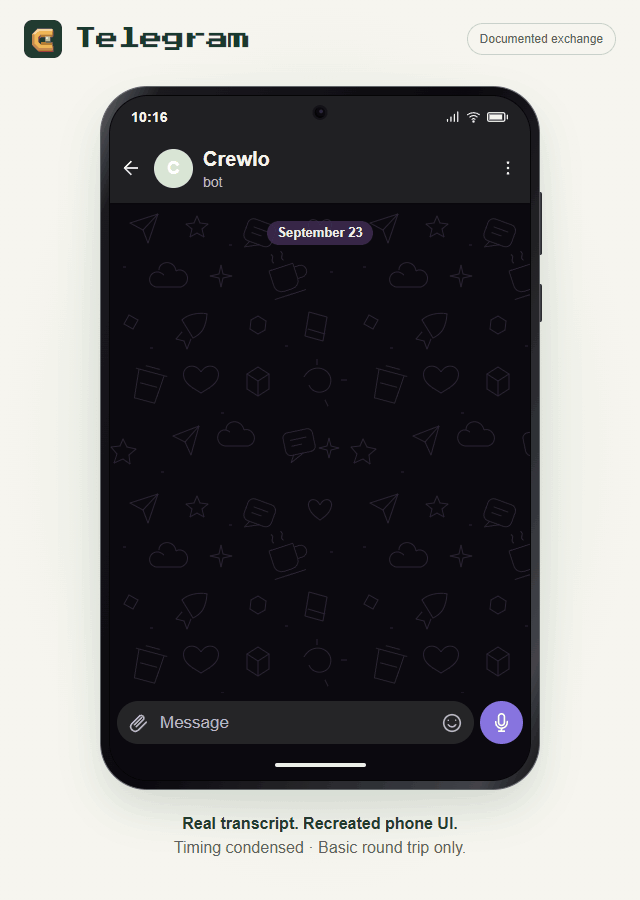
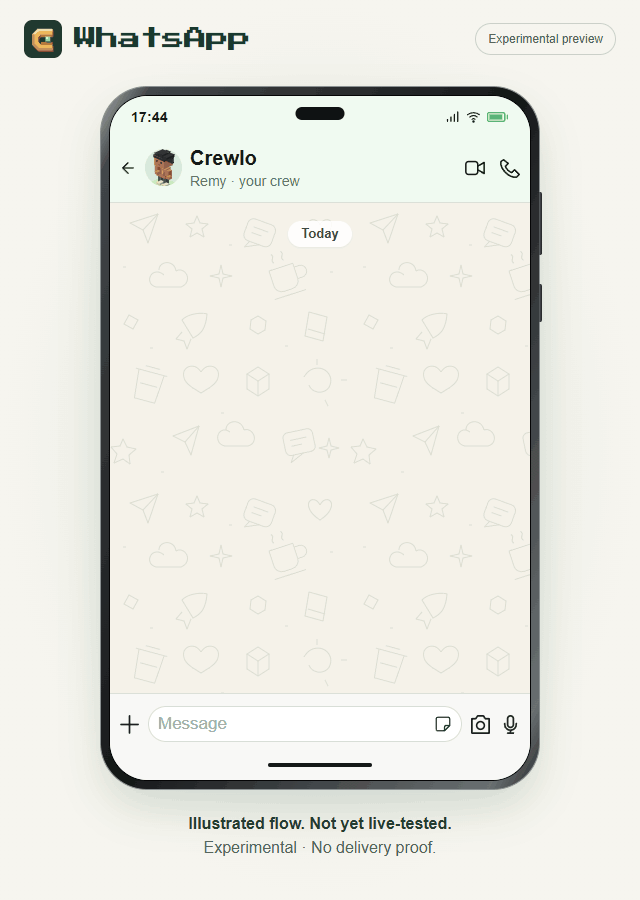
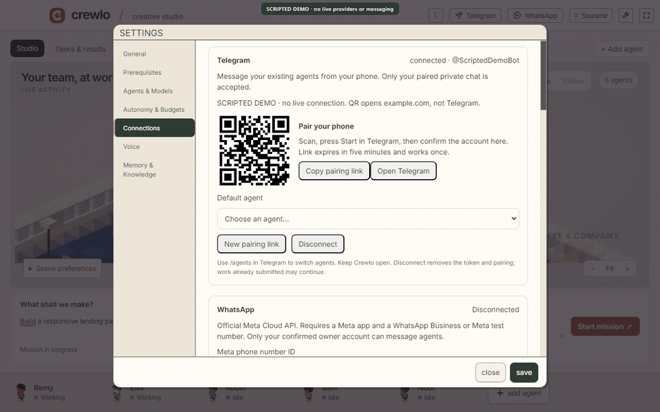

# Crewlo


## Your agents. A studio of their own.

Bring your coding agents into one visual workspace. Send a mission, follow the work, find the reply. A crew of twelve voxel characters makes the studio feel alive, from focused work to coffee breaks.

[Explore the interactive studio](https://hafididrissi.github.io/Crewlo/#crew) · [Read the journal](https://hafididrissi.github.io/Crewlo/blog/) · [Build from source](#build-from-source) · [Windows & macOS packaging](#desktop-packaging)

[](docs/crewlo/demo/readme-studio.mp4)

*Illustrated demo · 12 seconds. Scripted mission and reply, not a live AI recording. [Watch the video](docs/crewlo/demo/readme-studio.mp4) · [Still image](docs/crewlo/demo/readme-studio-poster.png) · [Original interface capture](docs/crewlo/demo/studio-activity.gif) · [Studio MP4](docs/crewlo/demo/mission-studio.mp4).*

The GIFs play directly in the README when your GitHub animation preference allows it. Click an animation for the MP4, with playback controls. [Media & capture notes](docs/crewlo/demo/README.md).

### Your crew, one message away.

<table>
<tr><th>Telegram · documented exchange</th><th>WhatsApp · experimental</th></tr>
<tr>
<td align="center"><a href="docs/crewlo/demo/readme-telegram.mp4"></a></td>
<td align="center"><a href="docs/crewlo/demo/readme-whatsapp.mp4"></a></td>
</tr>
<tr>
<td>A basic request and named reply were verified in Telegram Web. The phone layout is recreated and the wait is condensed.</td>
<td>Illustrative flow: not a WhatsApp conversation or proof of delivery. Requires Meta Cloud API and an HTTPS relay.</td>
</tr>
<tr>
<td><a href="docs/crewlo/demo/telegram-phone-demo.md">Transcript & verification scope</a> · <a href="docs/crewlo/demo/readme-telegram-poster.png">Still image</a></td>
<td><a href="docs/crewlo/demo/whatsapp-phone-preview.md">Preview scope</a> · <a href="docs/crewlo/demo/readme-whatsapp-poster.png">Still image</a></td>
</tr>
</table>

**Early preview:** an unsigned Windows installer has been built and checked locally. No public installer download or release feed is advertised here. macOS/Linux runtime validation and live WhatsApp delivery remain open. [Details & limits](#current-status).

<details>
<summary>Latest changes & earlier captures</summary>

### Latest work — September 2026

- **A living studio on the website.** Choose a sample mission and agent, follow the four steps, pause or replay. Select a character to see their activity and last illustrated reply beside the scene.
- **Twelve provider presets.** Four featured figurines with an expandable shelf; the desktop onboarding now includes Gemini in its twelve-engine list. Presets are not a claim that every provider has been live-tested.
- **One messaging section.** Telegram and experimental WhatsApp previews share tabs, with redesigned phone layouts and evidence kept next to each feature.
- **Windows preview installer.** French/English setup, per-user installation, branded shortcuts, and checks of the packaged terminal, SQLite, onboarding and settings persistence.
- **Safer Windows worktree cleanup.** Shared dependency junctions are detached before removal; other links cause removal to be refused to protect external files.
- **macOS packaging checks.** Universal Intel/Apple Silicon targets reviewed and universal-DMG selection fixed. Building and running the installer still requires a Mac.

[Current preview notes](RELEASE.md) · [Changelog](CHANGELOG.md) · [Details & limits](#current-status)


[Earlier Telegram animation](docs/crewlo/demo/telegram-phone-demo.gif) · [Earlier WhatsApp animation](docs/crewlo/demo/whatsapp-phone-preview.gif).

</details>

## Why Crewlo?

- **See the work, not just the terminals.** Activity labels above agents reflect execution-hook events when available. Select a character to inspect its conversation or terminal.
- **Give the crew one clear mission.** A wide composer keeps your request in focus, with one delivery status and an explicit Resume control when message delivery is paused.
- **Keep the useful tools close.** Tasks & results, Approvals & input, Memory and Settings remain part of the same workspace.
- **Check in from your phone.** Telegram has a verified basic message round trip. Optional Telegram and WhatsApp connections route paired-owner messages to existing connected agents, with replies and channel badges in Conversation; WhatsApp still needs a live account-to-agent test.

Bring the agent CLI you already use: provider presets include Claude Code, Codex, Gemini CLI and others. Your accounts and credentials stay under your control; coordination and remote-messaging support vary by provider.

## Current status

| Area | Verified scope | Remaining limits |
| --- | --- | --- |
| Windows installer | French setup on the development PC; rebuilt package starts; SQLite, PTY and settings persistence pass | Unsigned; no clean-PC or completed uninstall test |
| Real agent | Codex read a temporary file and returned the exact marker through packaged Crewlo IPC and PTY | Does not establish full hive routing, all providers or messaging delivery |
| Website | Five widths from 320 to 1440 px; keyboard selection, timed animations, pause, offscreen stop and reduced motion | Illustrated agents and missions; full accessibility audit remains open |
| macOS | Universal DMG/ZIP configuration, icon and permissions files checked; targeted tests pass | No DMG built or installed; requires a Mac |
| Linux | Packaging configuration retained | Runtime and installer not validated |

The 27 September full-suite run passed **959 tests, with 0 failures and 8 skipped** (967 total), including the signing-command and universal-DMG regressions. Earlier baseline failures are resolved; the old report remains as historical evidence. [Windows validation](docs/crewlo/WINDOWS-VALIDATION.fr.md) · [macOS validation](docs/crewlo/MACOS-VALIDATION.fr.md) · [Historical baseline](docs/crewlo/VERIFICATION.md).

A basic real Telegram request and named reply were [observed in Telegram Web](docs/crewlo/demo/telegram-phone-demo.md); that does not prove every agent, reconnection or physical-phone scenario. Automated messaging tests use simulated Telegram/Meta traffic and agent replies. WhatsApp still needs a [live acceptance test](docs/messageries-tests.fr.md). Additional live messaging checks and signing are deferred. There is no Crewlo release feed or enabled automatic update service.

## Build from source

You need Git, **Node.js 22.22 or newer**, npm, and the credentials required by your chosen agent CLI. Provider setup is available through onboarding; provider subscriptions and API usage are separate from Crewlo.

On **Windows**, the native `node-pty` dependency also requires Visual Studio C++ build tools, the Windows SDK and matching MSVC Spectre-mitigated libraries. If installation reports `MSB8040`, add those libraries in Visual Studio Installer, then rerun `npm ci`.

Run `npm run doctor` from the checkout to check prerequisites before installing, and again after installation to check the native runtime. It does not install software or change your settings. [Windows quick start and troubleshooting — français](docs/crewlo/QUICKSTART.fr.md).

Clone the repository, or skip the first two commands if you already have a checkout:

```sh
git clone https://github.com/HafidIdrissi/crewlo.git
cd crewlo
npm ci
npm run dev
```

Complete onboarding, connect an agent and open a studio. Review the chosen CLI's permissions and automation settings before giving it work; execution permissions depend on those settings.

To check the code and preview a production build:

```sh
npm run typecheck
npm run test:focused
npm run build
npm run preview
```

Despite its historical name, `test:focused` runs all `test/*.test.cjs` files with portable filename expansion. `npm run test:crewlo` runs the smaller Crewlo-specific smoke suite. Live provider checks are separate and can consume provider usage.

## Desktop packaging

| Command | Purpose |
| --- | --- |
| `npm run dist:win` | Build Windows x64 NSIS with native-module reconstruction |
| `npm run dist:win:preview` | Local Windows preview using already installed, validated native modules |
| `npm run dist:win:signed` | Require code signing; needs your signing credentials and native build tools |
| `npm run dist:mac` | Build universal DMG and ZIP **on macOS** |

These platform commands do not publish. The Windows preview produces
`dist/windows-preview/Crewlo-0.4.6-win-x64-preview-setup.exe` locally; this path is
not a public download. It does not prove a clean native rebuild or another PC's
compatibility. macOS expects `dist/Crewlo-0.4.6-mac-universal.dmg` after a successful
Mac build. Signing and Apple notarization have not been validated.

[Windows installer guide](docs/crewlo/WINDOWS-INSTALLER.fr.md) · [Mac checks and next steps](docs/crewlo/MACOS-VALIDATION.fr.md)

## In the studio

1. Start a mission from the composer. Crewlo routes it through the coordinator and message-delivery controls.
2. Click a figurine or use the keyboard-accessible roster to open an agent's conversation or terminal.
3. Open Tasks & results to inspect actual task records, or Approvals & input when work needs your attention.
4. If the composer says **Message delivery paused**, use **Resume** on the desktop when you are ready.

<details>
<summary>Scene controls, accessibility and visual states</summary>

- Collapse the agent panel to focus on the studio, or drag its divider to resize it. With the scene focused, arrow keys pan, +/− zoom, and 0 or Fit resets the camera.
- Additional agents expand the individual desks. The roster scrolls as the crew grows.
- In smaller windows, the conversation panel sits below the studio. Selecting an agent scrolls to it; **Back to studio** returns to the scene. Reduced motion disables figurine animation.
- Agents come from the actual roster. Confirmed idle agents may take clearly labeled cosmetic breaks, rendered locally without prompts or tokens. Unknown, queued, blocked and disconnected agents never take leisure breaks. Smoking is opt-in per agent in Scene preferences.
- The workshop, break room, game room and terrace are visual zones, not separate autonomous teams.

[Voxel implementation and verification](docs/crewlo/VOXEL.md) · [1920 desktop](docs/crewlo/voxel-workplace-1920.png) · [1440 desktop](docs/crewlo/voxel-workplace-1440.png) · [Empty studio](docs/crewlo/voxel-empty.png) · [Animation recording](docs/crewlo/voxel-animation.webm)

Populated screenshots are labeled test fixtures, not evidence of running agents or completed work.

</details>

## From your phone

Both channels use single-use pairing links/QRs and desktop confirmation. Only the paired owner's private messages are accepted. They use existing connected agent sessions; they do not start agents, approve tools or remotely resume paused delivery. Keep Crewlo open and your PC awake.

| | Telegram | WhatsApp |
| --- | --- | --- |
| Official transport | Bot API long polling | Meta Cloud API and signed webhooks |
| What you supply | A BotFather bot token | Meta app, Cloud API number, access token, App secret and verification token |
| Public endpoint | None required | Your own HTTPS callback forwarded to Crewlo's local receiver |
| Important limit | Another poller/webhook must not use the same bot | Free-form replies need an open 24-hour user-message window; no automatic tunnel setup |

Open **Telegram** or **WhatsApp** from Crewlo's top bar, complete setup and confirm your identity on the desktop. Send `/agents` to list agents, then `/agent <id>` to select one. Send plain text and check the agent-named reply in your phone chat and Crewlo's Conversation view.

[Telegram setup](docs/telegram-setup.md) · [Telegram + WhatsApp setup and live-test checklist — français](docs/messageries-tests.fr.md)

Want to see the verified basic Telegram exchange before setting up a bot? [Watch the 20-second phone-style GIF](docs/crewlo/demo/telegram-phone-demo.gif), then read its [verification scope](docs/crewlo/demo/telegram-phone-demo.md).

The [WhatsApp phone GIF](docs/crewlo/demo/whatsapp-phone-preview.gif) is an illustrative preview only. A real WhatsApp phone-to-agent round trip has not yet been verified.

WhatsApp's **Accepted** state is not proof of delivery: **Delivered** and **Read** come from Meta receipts. Paused, unavailable, failed or uncertain delivery remains visible. Consult Conversation before resending an uncertain message.

<details>
<summary>Watch the Telegram setup interface demo</summary>



*Scripted setup demo only. The QR opens example.com and cannot pair a bot. No real Telegram delivery is shown. [Static setup image](docs/crewlo/demo/telegram-poster.png).*

</details>

## Local workspace, explicit connections

Crewlo stores workspace state locally. Telegram and WhatsApp credentials use an OS-encrypted vault, with no plaintext fallback; conversation history is not encrypted by those features. Connected cloud providers and messaging services receive the data needed for their work—local-first does not mean offline-only.

Anonymous usage analytics requires a configured build-time key and can be disabled in Settings or with `DO_NOT_TRACK`. See the [telemetry contract](TELEMETRY.md) for its allowlisted events.

## Help shape Crewlo

Try the source, [report a reproducible bug](https://github.com/HafidIdrissi/Crewlo/issues/new/choose), [suggest an idea](https://github.com/HafidIdrissi/Crewlo/discussions), or take on one small improvement. Windows/macOS/Linux verification, accessibility, messaging and clearer agent activity are useful places to contribute. Read the [contribution guide](CONTRIBUTING.md) before opening a PR.

If Crewlo interests you, [give the repository a star](https://github.com/HafidIdrissi/crewlo). Starring happens on GitHub after you sign in; Crewlo never requests a GitHub token or stars automatically.


**Buy me a coffee:** the payment link is enabled only after the maintainer supplies their own profile URL. The website, app and Windows installer show the supplied brand design with an inactive button while the profile is unconfigured. No donation is routed to an unconfirmed account. The destination is configured in [docs/crewlo-links.json](docs/crewlo-links.json).

### Preview the website locally

After installing dependencies, run:

```sh
npm run site
```

Open the localhost address shown in your terminal. This serves the website locally; it does not publish anything.

[Shareable demo kit](docs/crewlo/demo/README.md) · [Design system](DESIGN.md) · [Asset origins](docs/crewlo/ASSETS.md) · [Engine architecture](docs/ARCHITECTURE.md)

## Credits

Crewlo is independently maintained and builds on [Munder Difflin](https://github.com/chaitanyagiri/munder-difflin), by Chaitanya Giri and contributors. The original copyright notices and [MIT license](LICENSE) are preserved. [Engineering notes](docs/crewlo/ENGINEERING_NOTES.md) cover the project's foundations and compatibility choices.

Original Crewlo artwork is MIT-licensed. Bundled third-party art and fonts retain their own licenses, including credits to [LimeZu](https://limezu.itch.io/) and [shahar061/the-office](https://github.com/shahar061/the-office). See [asset licenses](LICENSE-ASSETS) and [full attribution](src/renderer/src/assets/ATTRIBUTION.md).
